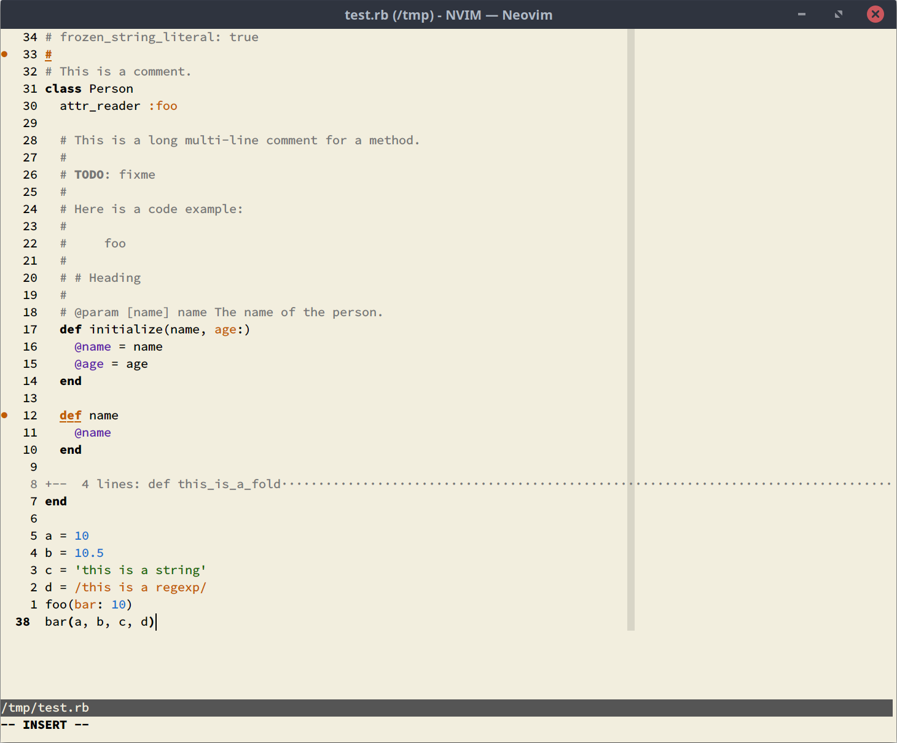
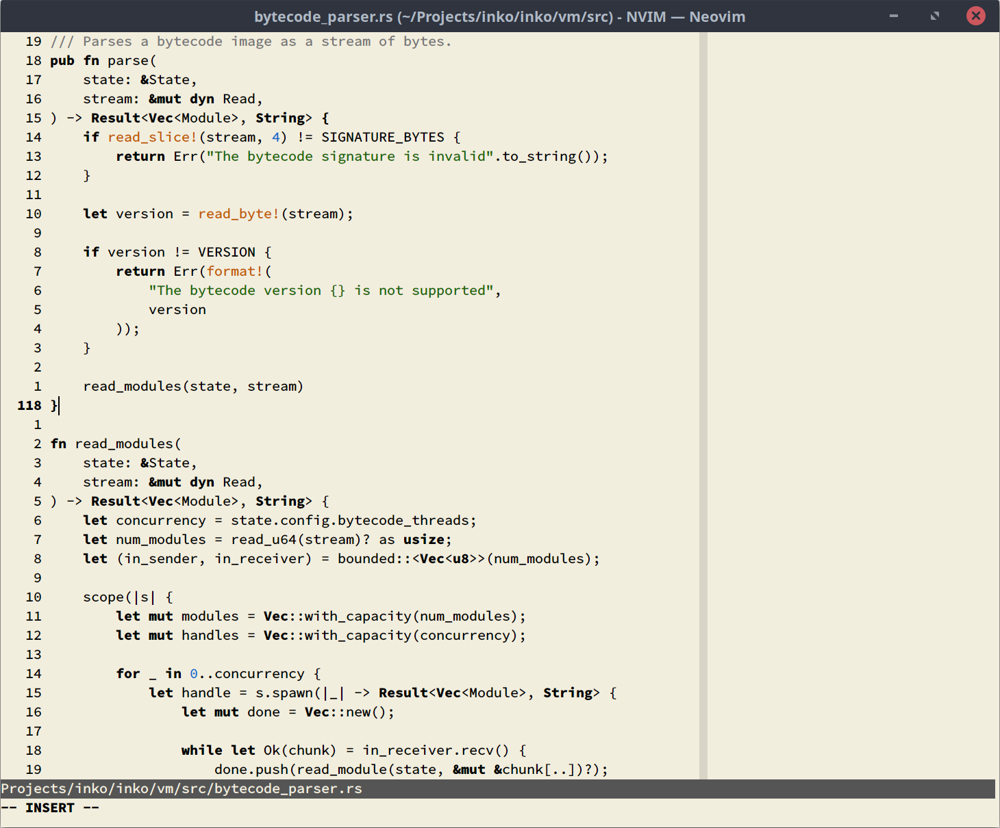
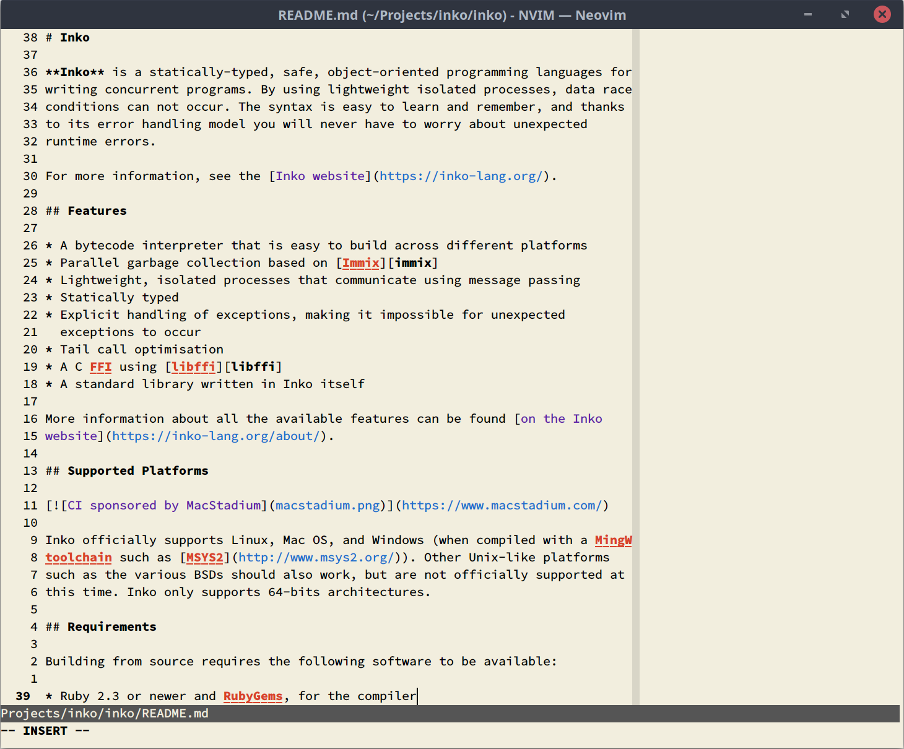

# Vim Paper

A personal light theme for (Neo)Vim, based on the color of paper as found in
various notebooks.

I created Paper as a replacement for [Happy
Hacking](https://gitlab.com/yorickpeterse/happy_hacking.vim), and the
[Autumn](https://gitlab.com/yorickpeterse/Autumn.vim) theme it was originally
based on. I've been using dark themes for the last decade or so, and mostly
without issues. But dark themes are not necessarily a good choice for your eyes,
and research has shown that it's generally better to have dark text on a light
background (see [this StackExchange question for some interesting
data](https://ux.stackexchange.com/questions/53264/dark-or-white-color-theme-is-better-for-the-eyes)).
In addition, [halation](https://en.wiktionary.org/wiki/halation) becomes a
problem when presenting light text on (very) dark backgrounds.

Besides the issues with dark themes, I also simply wanted a theme with fewer
colors; making the colors that _are_ used stand out more. I couldn't squeeze
this into the Happy Hacking theme without fundamentally changing it, so I
created a new theme instead.

Please note that this theme is designed with the following display properties in
mind:

* An LCD/TFT display
* A display temperature range of 4000K-5200K
* A low display brightness

## Screenshots

| Ruby                          | Rust                          | Markdown
|:------------------------------|:------------------------------|:-------------
|  |  | 

## Terminal colors

If you want to use Paper as your terminal theme, you can use the following color
palette:

| Color   | Normal    | Bright    | GNOME Terminal color index
|:--------|:----------|:----------|:--------------------------
| Black   | `#000000` | `#555555` | 0, 8
| Red     | `#CC3E28` | `#CC3E28` | 1, 9
| Green   | `#216609` | `#216609` | 2, 10
| Yellow  | `#B58900` | `#B58900` | 3, 11
| Blue    | `#1E6FCC` | `#1E6FCC` | 4, 12
| Purple  | `#5C21A5` | `#5C21A5` | 5, 13
| Cyan    | `#158c86` | `#158c86` | 6, 14
| White   | `#AAAAAA` | `#AAAAAA` | 7, 15

For the text color, highlight color, etc, use:

| Color     | Foreground | Background
|:----------|:-----------|:------------
| Text      | `#000000`  | `#F2EEDE`
| Highlight | `#000000`  | `#D8D5C7`

## Requirements

* A recent version of (Neo)Vim
* For best results, a (Neo)Vim GUI with true-color support

## Installation

Using vim-plug, add the following to your `init.vim`:

    Plug 'https://gitlab.com/yorickpeterse/vim-paper.git'

Then run `PlugInstall` to install it, followed by `color paper` to enable the
theme.

## Building

To build a new version of the theme, you need to have
[vim-colortemplate](https://github.com/lifepillar/vim-colortemplate) installed.

When installed, open `templates/paper.colortemplate`, make your changes, then
run the following to update the theme:

    :cd templates
    :Colortemplate! ..

## License

All source code in this repository is licensed under the Mozilla Public License
version 2.0, unless stated otherwise. A copy of this license can be found in the
file "LICENSE".
